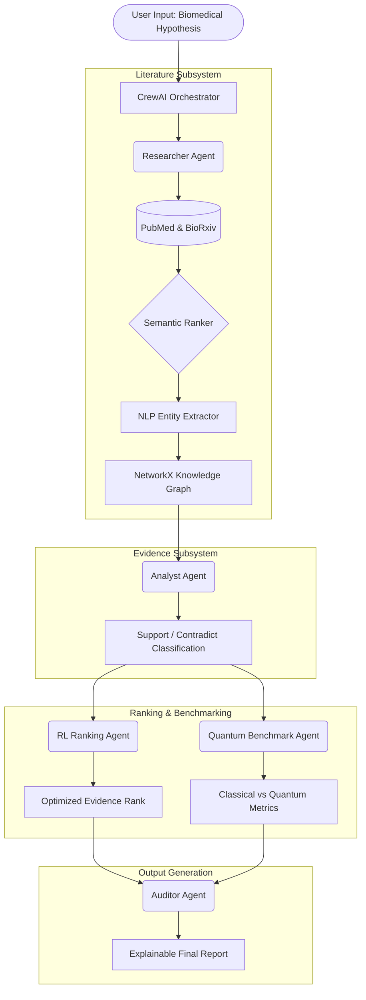

# Multi-Agent XAI for Biomedical Hypothesis Analysis

## Project Goal
The goal of this project is to build an automated, highly transparent, multi-agent AI system that evaluates complex biomedical hypotheses. By leveraging multiple specialized AI agents, the system simulates a team of human researchers working together. It fetches peer-reviewed literature, reads abstracts to extract evidence, ranks the papers based on deep semantic meaning, and constructs a Knowledge Graph. 

Currently, the system is being tailored with a specialized focus on **Women's Health Research** (such as Polycystic Ovary Syndrome, Endometriosis, and Maternal-Fetal Medicine), providing researchers with high-quality, domain-specific insights.

## Input and Output
*   **Input**: A user-provided biomedical hypothesis in plain English (e.g., "Polycystic Ovary Syndrome is strongly linked to insulin resistance").
*   **Output**: 
    *   A highly curated and semantically ranked list of relevant research papers.
    *   A structured breakdown of supporting and contradicting evidence extracted directly from the texts.
    *   An explainable "verdict" generated by an XAI (Explainable AI) Auditor Agent.
    *   A machine-readable Knowledge Graph (JSON format) detailing the relationships between extracted diseases, genes, and chemicals.

## Summarized Workflow

**Active Agents**: `Researcher Agent`, `Evidence Analyst Agent`, `XAI Auditor Agent` 
*(Planned: `RL Ranking Agent`, `Quantum Benchmark Agent`, `Methodology Planner`, `Review Writer`)*

The system orchestrates a sequential process using the CrewAI framework. Here is the visual pipeline:

### Step-by-Step Breakdown:
1.  **Ingestion**: A Researcher Agent queries PubMed and BioRxiv APIs to fetch the most relevant and recent scientific literature.
2.  **Semantic Ranking**: Rather than relying on simple keyword matching, the system uses neural sentence embeddings to rank the fetched papers based on their true contextual relevance to the hypothesis.
3.  **Entity Extraction & Graphing**: A Natural Language Processing (NLP) module scans the top papers, extracting key medical entities, and automatically constructs a NetworkX Knowledge Graph to map their relationships.
4.  **Evidence Analysis**: An Analyst Agent evaluates the text to categorize claims as supporting, contradicting, or neutral.
5.  **Advanced Ranking (Planned)**: An RL Ranking Agent optimizes the final list of evidence using synthetic rewards, while a Quantum Benchmark Agent runs parallel classical (SVM) and quantum (QSVM) models to compare performance.
6.  **Explainable Audit**: Finally, an Auditor Agent reviews the entire trace and generates a clear, transparent final report.

## Work Completed (Current Status)
*   **Architecture Established**: Modular directory structure and environment (`requirements.txt`) set up.
*   **Literature Pipeline Functional**: Fully operational retrieval from both PubMed and BioRxiv.
*   **Semantic Upgrades**: Replaced legacy TF-IDF ranking with advanced `sentence-transformers`.
*   **NLP & Graphing Functional**: Automated Named Entity Recognition (NER) using `spaCy` and automatic generation of co-occurrence graphs using `NetworkX`.
*   **Agent Tools**: Wrapped the literature and evidence pipelines into `BaseTool` classes compatible with CrewAI.

## Directory Structure and Key Files

### Orchestration
*   `src/orchestrator/crew_manager.py`: The brain of the operation. It defines the CrewAI agents (Researcher, Analyst, Auditor) and the sequential tasks they must complete.

### Literature Subsystem (`src/agents/literature/`)
*   `literature_agent.py`: The main controller for the literature pipeline. It coordinates searching, fetching, embedding, and graphing.
*   `pubmed_fetcher.py` & `biorxiv_fetcher.py`: Modules responsible for communicating with external scientific databases.
*   `query_builder.py`: Formats the user's natural language hypothesis into strict database search queries.
*   `embedding_model.py`: Handles the `sentence-transformers` logic for semantic ranking.
*   `nlp_extractor.py`: Uses `spaCy` to perform Named Entity Recognition on medical abstracts.
*   `graph_builder.py`: Uses `NetworkX` to build the Knowledge Graph from extracted entities.
*   `literature_tools.py`: The interface that allows the CrewAI agents to use the Literature subsystem.

### Evidence Subsystem (`src/agents/evidence/`)
*   `evidence_agent.py`: Parses sentences from abstracts to heuristically classify them as supporting or contradicting the hypothesis.
*   `evidence_tools.py`: The interface that allows the CrewAI agents to use the Evidence subsystem.

### Data and Planning
*   `data/`: Stores the output artifacts, such as the `current_knowledge_graph.json`.
*   `docs/planning/`: Contains the implementation roadmap and immediate next tasks for the development team.