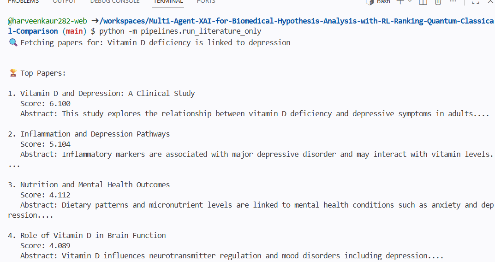

## 1. Project Structure Setup

A modular machine learning-style repository was designed to support scalable development. The project was organized into structured components including agents, pipelines, data, experiments, and configuration files.

This setup establishes a research-grade architecture rather than a single-script implementation, enabling future integration of reinforcement learning, explainability modules, and quantum-classical comparison components.

## 2. Mock Biomedical Dataset Creation

A synthetic biomedical dataset was created in JSON format (sample_pubmed_results.json) containing sample research paper entries with titles and abstracts.

It is important to note that this dataset is not sourced from PubMed or any external biomedical database. Instead, it serves as a controlled prototype dataset for testing and developing the initial literature analysis pipeline.

## 3. Literature Agent Implementation

A Literature Agent was implemented as a class-based module responsible for processing biomedical hypotheses and ranking relevant research papers.

The agent performs the following functions:

Data Loading: Reads structured research paper data from a JSON file using Python file handling operations.
Hypothesis Processing: Accepts a biomedical hypothesis as input for analysis.
Relevance Scoring: Computes a relevance score for each paper based on word overlap between the hypothesis and paper text, along with a minor weighting based on abstract length.
Ranking: Sorts all papers in descending order of relevance score to identify the most relevant research articles.

## 4. End-to-End Pipeline Execution

A pipeline script (run_literature_only.py) was developed to execute the complete workflow.

This script initializes the Literature Agent, processes a given biomedical hypothesis, executes the scoring and ranking pipeline, and outputs the top-ranked research papers along with their relevance scores and abstracts.

## 5. Debugging and System Stabilization

Several foundational engineering issues were identified and resolved during implementation, including:

Python module import resolution issues within a modular project structure
JSON data format inconsistencies between list and dictionary structures
Empty or invalid dataset handling errors
Runtime pipeline execution issues

These fixes ensured stable execution of the end-to-end literature processing workflow and reflect core debugging practices commonly encountered in machine learning system development.

