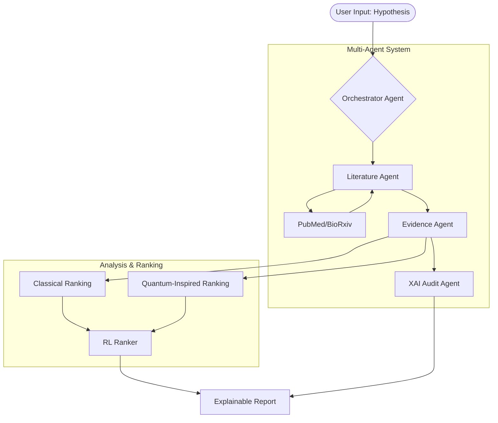

# Project Implementation Plan: Multi-Agent XAI for Biomedical Hypothesis Analysis

This document outlines the architecture, feasibility analysis, and implementation roadmap for the project.

## Project Analysis & Feasibility

The project name reflects a sophisticated, multi-layered system designed to automate and explain biomedical research validation.

### Architecture Overview
The system is designed as a modular pipeline specifically tailored for **Women's Health Research**:
1.  **Ingestion**: Retrieval of scientific literature (PubMed/BioRxiv) with optimized queries for gynecology, obstetrics, and female-specific pathophysiology.
2.  **Evidence Extraction**: Fine-grained analysis of abstracts to find supporting/contradicting claims.
3.  **Reasoning (Multi-Agent)**: Multiple specialized agents (Literature, Evidence, Reasoning, Audit) collaborating to evaluate the hypothesis. The agents will be primed with domain expertise in Women's Health.
4.  **Ranking (RL)**: Optimization of hypothesis ranking based on evidence strength and relevance.
5.  **Benchmarking (Quantum vs. Classical)**: Comparing classical NLP/ML performance with Quantum Machine Learning (QML) approaches.

### Feasibility Assessment
*   **High Feasibility**: Multi-agent orchestration using **CrewAI**, literature retrieval, and heuristic evidence extraction.
*   **Moderate Feasibility**: RL-based ranking. Since no ground truth data is available, we will use an **"LLM-as-a-Judge" synthetic feedback loop** to generate rewards.
*   **Experimental/Research**: Quantum-Classical comparison using **Qiskit Simulators**. This is feasible for demonstrating QML principles without needing physical hardware.

## Proposed System Flow

## Tools & Technology Stack

| Component | Recommended Tool/Library | Status |
| :--- | :--- | :--- |
| **Orchestration** | **CrewAI** (industry-standard task-based agents) | Planned |
| **Literature Fetching** | `Biopython` (Entrez), `Requests` | Partially Done |
| **NLP / Processing** | `NLTK`, `spaCy`, `scikit-learn` | Partially Done |
| **Reinforcement Learning** | `Gymnasium`, `Stable-Baselines3`, `LLM-Reward` | Planned |
| **Quantum Computing** | **Qiskit (Simulator)** | Planned |
| **Explainability (XAI)** | **SHAP**, **LIME**, & Reasoning Trace Logs | Planned |
| **Deployment** | **Streamlit** (for the interactive demo) | Planned |

## Implementation Phases

### Phase 1: Foundation (Current Status)
*   [x] Basic directory structure.
*   [x] Literature retrieval (PubMed).
*   [x] Heuristic evidence extraction.

### Phase 2: CrewAI Orchestration, CLI Input & Domain Shift (Next Steps)
*   [ ] Refactor `crew_manager.py` to use `argparse` or interactive `input()` to stop hardcoding hypotheses.
*   [ ] Update CrewAI Agent roles and backstories to be specialists in **Women's Health and Gynecology** (e.g., PCOS focus).
*   [ ] Refactor agents into **CrewAI Agents** (Researcher, Analyst, Auditor).
*   [ ] Define **CrewAI Tasks** for sequential literature-to-evidence flow.
*   [ ] Implement XAI by surfacing the `thought` process of each agent in the UI.

### Phase 3: RL Ranking (Synthetic Reward Approach)
*   [ ] Define `RankerEnv` (Gymnasium environment).
*   [ ] **Approach**: Use an LLM (GPT-4 or Claude) to score a small set of rankings.
*   [ ] Train a PPO agent to mimic the "expert" ranking behavior.

### Phase 4: Quantum Comparison (Simulated)
*   [ ] Implement a Classical SVM/Classifier baseline.
*   [ ] Implement a **QSVM** using **Qiskit simulators**.
*   [ ] Compare performance metrics (feature map efficiency vs. classical kernels).

### Phase 5: Deployment
*   [ ] Build a **Streamlit** dashboard.
*   [ ] Integration: User enters hypothesis -> CrewAI runs -> RL ranks -> Quantum benchmarks -> Results displayed.

### Phase 6: Future Interactive Environment Capabilities (Idea Incubation)
*   [ ] **Methodology Planner Agent**: A specialized CrewAI agent that reads the extracted evidence and generates **Mermaid flowcharts** outlining potential experimental designs or methodologies the user could use for their own research paper.
*   [ ] **Auto-Literature Review Generator**: A "Review Writer" Agent that synthesizes the ranked papers, the Knowledge Graph, and the extracted evidence into a cohesive, fully-written **Literature Review document**.
*   [ ] **Feasibility**: **Highly Feasible**. Since we are already using the CrewAI framework, adding these features is as simple as defining two new Agents (`MethodologyPlanner` and `ReviewWriter`) and appending their Tasks to the end of the `BiomedicalResearchCrew` process. The outputs can be displayed natively in the Streamlit UI using markdown and `st.download_button` for the review doc.
