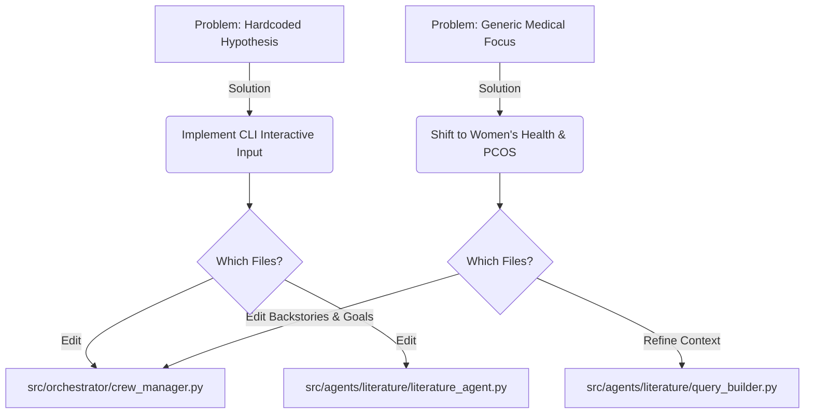

# Immediate Next Tasks

## Objective
1. **Dynamic Input**: Remove hardcoded hypotheses and allow the user to input any hypothesis interactively.
2. **Domain Focus (Women's Health / PCOS)**: Refine agent prompts, backstories, and queries to focus explicitly on Women's Health, particularly Polycystic Ovary Syndrome (PCOS).

## Problem Workflow & Solution

## Detailed File Edits

### 1. `src/orchestrator/crew_manager.py`
- **What to edit**: 
  - Update the `if __name__ == "__main__":` block to use Python's `input()` function so the program prompts: *"Enter the biomedical hypothesis to evaluate: "*.
  - Update `researcher_agent`, `analyst_agent`, and `auditor_agent` backstories to specify they are "Experts in Women's Health, Gynecology, and Endocrinology (specifically PCOS)".
- **Why**: Makes the orchestration system dynamic and tailored to the chosen research field, making it highly specific for the project demonstration.

### 2. `src/agents/literature/literature_agent.py` & `evidence_agent.py`
- **What to edit**: 
  - Change the hardcoded testing strings (e.g., `"Vitamin D deficiency..."`) to accept CLI arguments using `sys.argv` or `input()`.
- **Why**: Ensures individual modules can be tested dynamically without opening the code.

### 3. `src/agents/literature/query_builder.py`
- **What to edit**: 
  - Update the logic to optionally inject domain context (e.g., adding `AND (PCOS OR "Polycystic Ovary Syndrome")` if applicable) to ensure the literature fetched is highly relevant to the new domain.
- **Why**: Improves the accuracy of the PubMed and BioRxiv search results.
